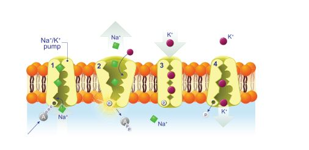

**5.4 Biological importance of sodium and potassium**

Monovalent sodium and potassium ions are found in large proportions in biological fluids. These ions perform important biological functions such as maintenance of ion balance and nerve impulse conduction. A typical 70 kg man contains about 90 g of sodium and 170 g of potassium compared with only 5 g of iron and 0.06 g of copper.

Sodium ions are found primarily on the outside of cells, being located in blood plasma and in the interstitial fluid which surrounds the cells. These ions participate in the transmission of nerve signals, in regulating the flow of water across cell membranes and in the transport of sugars and amino acids into cells. Sodium and potassium, although so similar chemically, differ quantitatively in their ability to penetrate cell membranes, in their transport mechanisms and in their efficiency to activate enzymes. Thus, potassium ions are the most abundant cations within cell fluids, where they activate many enzymes, participate in the oxidation of glucose to produce ATP and, with sodium, are responsible for the transmission of nerve signals.

Sodium–potassium pump play an important role in transmitting nerve signals.  

Figure 5.4 Sodium–potassium pump