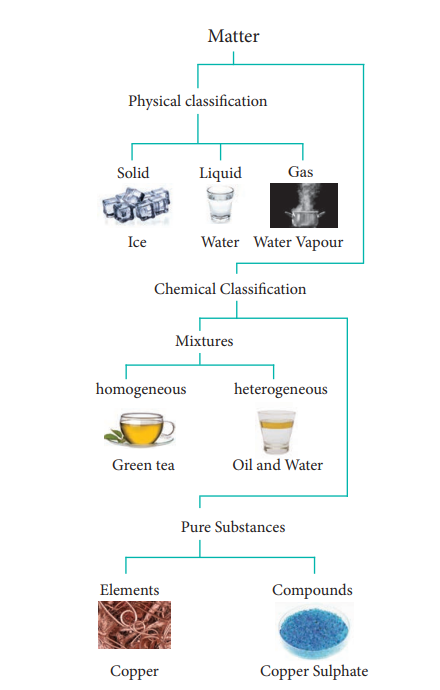

# Classification of Matter:

Look around your classroom. What do you see? You might see your bench, table, blackboard, window etc. What are these things made of ? They are all made of matter. Matter is defined as anything that has mass and occupies space. All matter is composed of atoms. This knowledge of matter is useful to explain the experiences that we have with our surroundings. In order to understand the properties of matter better, we need to classify them. There are different ways to classify matter. The two most commonly used methods are classification by their physical state and by chemical composition as described in the chart.

**1.2.1 Physical Classification of Matter :**

Matter can be classified as solids, liquids and gases based on their physical state. The physical state of matter can be converted into one another by modifying the temperature and pressure suitably.

**1.2.2 Chemical Classification :**

Matter can be classified into mixtures and pure substances based on chemical compositions. Mixtures consist of more than one chemical entity present without any chemical interactions. They can be further classified as homogeneous  

or heterogeneous mixtures based on their physical appearance.

Pure substances are composed of simple atoms or molecules. They are further classified as elements and compounds.

**Element :**

An element consists of only one type of atom. We know that an atom is the smallest electrically neutral particle, being made up of fundamental particles, namely electrons, protons and neutrons.

Element can exist as monatomic or polyatomic units.

Example : **Monatomic unit -** Gold (Au), Copper (Cu); **Polyatomic unit -** Hydrogen (H2), Phosphorous (PH4) and Sulphur (SH8)

**Compound:**

Compounds are made up of molecules which contain two or more atoms of different elements.

Example : Carbon dioxide (CO2), Glucose (C6H12OH6), Hydrogen Sulphide (H2S), Sodium Chloride (NaCl)

Properties of compounds are different from those of their constituent elements. For example, sodium is a shiny metal, and chlorine is an irritating gas. But the compound formed from these two elements, sodium chloride, shows different characteristics as it is a crystalline solid, vital for biological functions.

  

**Evaluate Yourself 1.1**

1) By applying the knowledge of chemical classification, classify each of the following into elements, compounds or mixtures.

(i) Sugar (ii) Sea water (iii) Distilled water (iv) Carbon dioxide (v) Copper wire (vi) Table salt (vii) Silver plate (viii) Naphthalene balls

?
