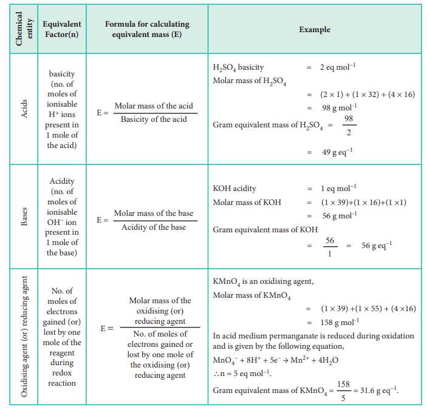

# Gram Equivalent Concept

Similar to mole concept gram equivalent concept is also widely used in chemistry especially in analytical chemistry. In the previous section, we have understood that mole concept is based on molecular mass. Similarly gram equivalent concept is based on equivalent mass.

**Definition:**

Gram equivalent mass is defined as the mass of an element (compound or ion) that combines or displaces 1.008 g hydrogen or 8 g oxygen or 35.5 g chlorine.

Consider the following reaction:

Zn+H4SO4 &rarr; ZnSO4+H2

In this reaction 1 mole of zinc (i.e. 65.38 g) displaces one mole of hydrogen molecule (2.016 g).

Mass of zinc required to displace 1.008 g hydrogen is = 65.38× 1.008 2.016

\= 65.38

2

The equivalent mass of zinc = 32.69

The gram equivalent mass of zinc = 32.69 g eq-1

Equivalent mass has no unit but gram equivalent mass has the unit g eq-1

It is not always possible to apply the above mentioned definition which is based on three references namely hydrogen, oxygen and chlorine, because we can not
conceive of reactions involving only with those three references. Therefore, a more useful
expression used to calculate gram equivalent mass is given below.
Gram equivalent mass = Molar mass (g mol-1)
Equivalence factor (eq mol-1)
On the basis of the above expression, let us classify chemical entities and find out
the formula for calculating equivalent mass in the table below

<!-- | cal  ymi tithe enC |Equivalent Factor(n) |Formula for calculating equivalent mass (E) |Example |
|------|------|------|------|
| scidA |basicity (no. of moles of ionisable H  ions present in 1 m+ole of the acid) |Molar mass of the acidE = Basicity of the acid |H SO basicity = 2 eq molMolar mass of H SO–12 4 = (2 × 1) + (1 × 32) + (4 × 16)2 4 =  98 g mol98Gram equivalent mass of H SO = 2 -12=  449 g eq–1 |
| esasB |Acidity (no. of moles of ionisable OH  ion present in 1 mo–le of the base) |Molar mass of the baseE = Acidity of the base |KOH acidity = 1 eq molMolar mass of KOH  = (1 × 39)+(1 × 16)+(1 ×1)–1=  56 g molGram equivalent mass of KOH 56 -1=  =  56 g eq1–1 |
| tgeng aucinedr) rt (ogeng asinxidiO |No. of moles of electrons gained (or) lost by one mole of the reagent during redox reaction |= Molar mass of the oxidising (or) reducing agentE No. of moles of electrons gained or lost by one mole of the oxidising (or) reducing agent |KMnO  is an oxidising agent,Molar mass of KMnO4 =  (1 × 39) +(1 × 55) + (4 ×16) 4 = 158 g molIn acid medium permanganate is reduced during oxidation and is given by the following equation, -1MnO  + 8H  + 5e  → Mn  + 4H O∴n = 5 eq mol .4– + – 2+ 2 158Gram equivalen–1t mass of KMnO  =  5  = 31.6 g eq .–14 |
   -->

require the same. We prefer to use mole concept for non-redox reactions and gram equivalent concept for redox reactions.

**For example,**

If we know the equivalent mass of KMnO4 and anhydrous ferrous sulphate, without writing balanced chemical reaction we can straightaway say that 31.6 g of KMnO4 reacts with 152 g of FeSO4using gram equivalent concept.

The same can also be explained on the basis of mole concept. The balanced chemical equation for the above mentioned reaction is

10 FeSO4 + 2 KMnO4 + 8 H2SO4 &rarr;
K2SO4 + 2MnSO4 + 5 Fe2(SO4)3 + 8H2O

i.e. 2 moles (2 × 158 = 316 g) of potassium permanganate reacts with 10 moles (10 × 152 = 1520 g) of anhydrous ferrous sulphate.

∴ 31.6 g KMnO4 reacts with

1520 316

× 31.6 = 152 g of FeSO4

?**Evaluate Yourself**

4a) 0.456 g of a metal gives 0.606 g of its chloride. Calculate the equivalent mass of the metal.

4b) Calculate the equivalent mass of potassium dichromate. The reduction half-reaction in acid medium is,

Cr2O42- + 14H2- +6e- → 2 Cr3+ +7H2O  