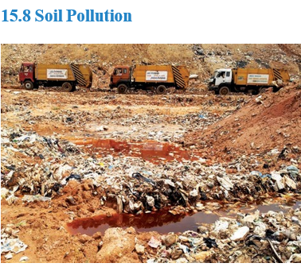

**Fig 15.7 soil pollution**

Soil is a thin layer of organic and inorganic material that covers the earth’s rocky surface. Soil constitutes the upper crust of the earth, which supports land, plants and animals.
Soil pollution is defined as the buildup  of  persistent  toxic  compounds
, radioactive materials, chemical salts and disease causing agents in soils which have harmful effects on plant growth and animal health.
Soil pollution affects the structure and fertility of soil, groundwater quality and food chain in biological ecosystem.

**1) Artificial fertilizers:**

Soil nutrients are useful for growth of plants. Plants obtains carbon, hydrogen and oxygen from air or water, whereas other essential nutrients like nitrogen, phosphorous, potassium, calcium, magnesium, sulphur are being absorbed from soil. To remove the deficiency of nutrients in soil, farmers add artificial fertilizers. Increased use of phosphate fertilizers or excess use of artificial fertilizers like NPK in soil, results in reduced yield in that soil.

**2) Pesticides:**

Pesticides are the chemicals that are used to kill or stop the growth of unwanted organisms. But these pesticides can affect the health of human beings.

 

These are further classified as

**a. Insecticides:**

Insecticides like DDT, BHC, aldrin etc. can stay in soil for long period of time and are absorbed by soil. They contaminate root crops like carrot, raddish, etc.

**b. Fungicide:**

Organo mercury compounds are used as most common fungicide. They dissociate in soil to produce mercury which is highly toxic.

**c. Herbicides:**

Herbicides are the chemical compounds used to control unwanted plants. They are otherwise known as weed killers. Example sodium chlorate (NaClO3) and sodium arsenite (Na3AsO3). Most of the herbicides are toxic to mammals.

**3) Industrial wastes**

Industrial activities have been the biggest contributor to the soil pollution especially the mining and manufacturing activities.

Large number of toxic wastes are released from industries. Industrial wastes include cyanides, chromates, acids, alkalis, and metals like mercury, copper, zinc, cadmium and lead etc. These industrial wastes in the soil surface lie for a long time and make it unsuitable for use.
