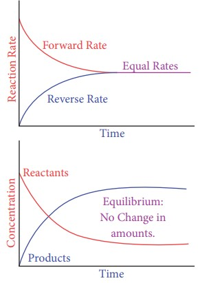

Similar to physical processes chemical reactions gradually attain a state of equilibrium after sometime. Let us consider a general reversible reaction.

A+B ⇌ C+D
|---|

Initially only A and B are present. Soon, a few molecules of the products C and D are formed by the forward reaction. As the concentration of the products increases, more products collide and react in the backward direction. This leads to an increase in the rate of backward reaction. As the rate of reverse reaction increases, the rate of the forward reaction decreases. Eventually, the rate of both reactions becomes equal.

