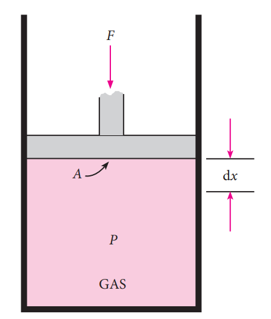
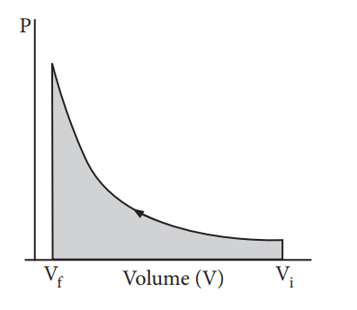

**HEAT(q)**

The heat (q) is regarded as an energy in transit across the boundary separating a system from its surrounding. Heat changes lead to temperature differences between system and surrounding. Heat is a path function.

**Units of heat:**

The SI unit of heat is joule (J). Heat quantities are generally measured in calories (cal). A calorie is defined as the quantity of heat required to raise the temperature of 1 gram of water by 1° C in the vicinity of 15° _C_.

**Sign convention of heat:**

The symbol of heat is _q_.

If heat flows into the system from the surrounding, energy of a system increases. Hence it is taken to be positive (+q).

If heat flows out of the system into the surrounding, energy of the system decreases. Hence, it is taken to be negative (–q).

**Work(w)**

Work is defined as the force (F) multiplied by the displacement(_x_).

−w = F. _x_ –––––––––––(7.1)

The negative sign (−) is introduced to indicate that the work has been done by the system by spending a part of its internal energy.  

The work,

(i) is a path function. (ii) appears only at the boundary of the

system. (iii) appears during the change in the state

of the system. (iv) In thermodynamics, surroundings is

so large that macroscopic changes to surroundings do not happen.

**Units of work:**

The SI unit of work is joule (J), which is defined as the work done by a force of one Newton through a displacement of one meter ( J= Nm). We often use kilojoule (_k_J) for large quantities of work. 1 kJ = 1000 J.

**Sign convention of work:**

The symbol of work is '_w_'.

If work is done by the system, the energy of the system decreases, hence by convention, work is taken to be negative (− w).

If work is done on the system, the energy of the system increases, hence by convention, the work is taken to be positive (+w).

**Pressure - volume work**

In elementary thermodynamics the only type of work generally considered is the work done in expansion (or compression) of a gas. This is known as pressure-volume work, PV work or expansion work.

  

**Work involved in expansion and compression processes:**

In most thermodynamic calculations we are dealing with the evaluation of work involved in the expansion or compression of gases. The essential condition for expansion or compression of a system is that there should be difference between external pressure (Pext) and internal pressure (Pint).

For understanding pressure- volume work, let us consider a cylinder which contains 'n' moles of an ideal gas fitted with a frictionless piston of cross sectional area A. The total volume of the gas inside is V_i_ and pressure of the gas inside is Pint.

If the external pressure Pext is greater than Pint, the piston moves inward till the pressure inside becomes equal to Pext. Let this change be achieved in a single step and the final volume be Vf.

In this case, the work is done on the system (+w). It can be calculated as follows

w = –F .Δx ------------ (7.2)

where dx is the distance moved by the piston during the compression and F is the force acting on the gas.

**Figure 7.3 showing work involved in compression processes**

F = PextA---- (7.3)

Substituting 7.3 in 7.2

w = – Pext. A. Δ x

A.Δx = change in volume = Vf - Vi

w = – Pext . (Vf - Vi) -––––– (7.4)

w = – Pext . (–ΔV) –––––– (7.5)

= Pext . ΔV

Since work is done on the system, it is a positive quantity.

If the pressure is not constant, but changes during the process such that it is always infinitesimally greater than the pressure of the gas, then, at each stage of compression, the volume decreases by an infinitesimal amount, dV. In such a case we can calculate the work done on the gas by the relation


w_{rev} = -\int_{vi}^{vf}P_{ext}dV


In a compression process, Pext the external pressure is always greater than the pressure of the system.

i.e Pext = (Pint + dP).

In an expansion process, the external pressure is always less than the pressure of the system

i.e. Pext = (Pint - dP).

**Figure 7.4**

When pressure is not constant and changes in infinitesimally small steps (reversible conditions) during compression from Vi to Vf , the P-V plot looks like in fig 7.4 Work done on the gas is represented by the shaded area.

In general case we can write,

Pext \= (Pint + dP). Such processes are called reversible processes. For a compression process work can be related to internal pressure of the system under reversible conditions by writing equation  


w_{rev} = -\int_{vi}^{vf}P_{int}dV


for the given system with an ideal gas

P_{int}V = nRT\newline
P_{int} = \frac{nRT}{V}\newline
w_{rev} = -\int_{vi}^{vf}\frac{nRT}{V}dV\newline
w_{rev} = -nRT\int_{vi}^{vf}(\frac{dV}{V})\newline
w_{rev} = -nRT ln(\frac{V_f}{V_i})\newline
w_{rev} = -2.303nRT log(\frac{V_f}{V_i}) ---- 7.6\newline


If Vf \>Vi (expansion), the sign of work done by the process is negative.

If Vf <Vi (compression) the sign of work done on the process is positive.

**Table: 7.3 Summary of sign conventions**

| 1. |If heat is absorbed by the system |: |+q |
|------|------|------|------|
| 2. |If the heat is evolved by the system |: |-q |
| 3. |work is done by the system |: |−w |
| 4. |work is done on the system |: |+w |
